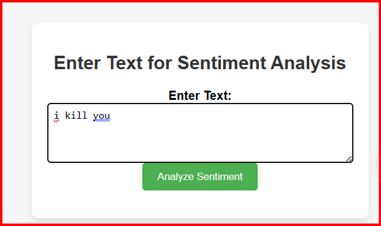

# Full Stack and Machine learning mini project

## In this application I am using two sever
1. Spring Boot server
2. Jsp for rendering
3. Flask Server to run ML model.
4. NLP is used to preprocess sentiment.

__Index-Page__
 

 
__Result-Page__

